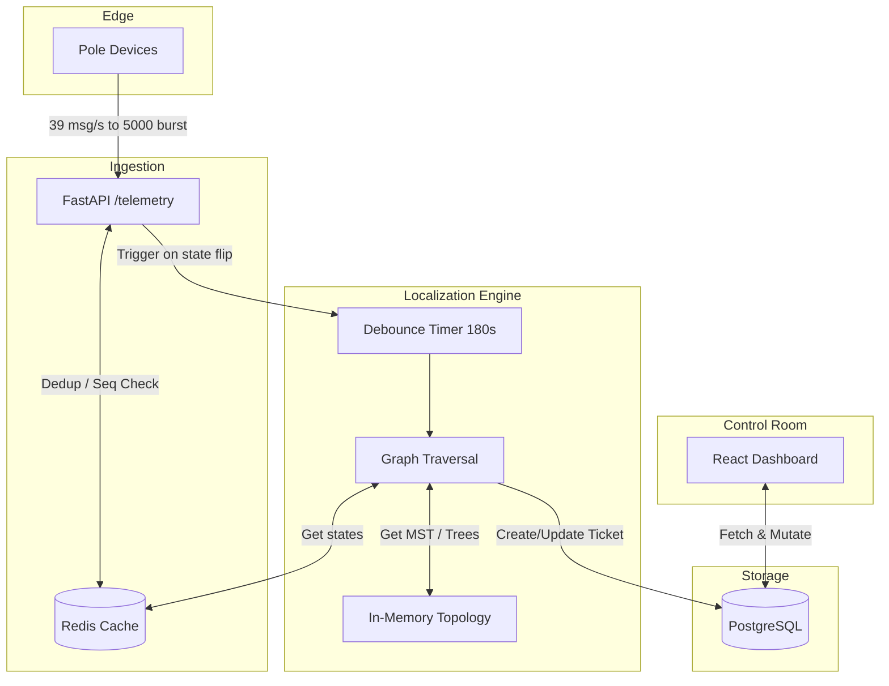

# Architecture & Design

## 1. System Diagram

## 2. Data Sourcing and Ingestion

The system handles a steady state of 39 msg/s and monsoon bursts up to 5,000 msg/10s.
- **Fast Path**: The `/telemetry` endpoint simply writes to Redis. We do not do graph traversals on the hot path.
- **Deduplication**: We store the `last_seq` per device in Redis. If `incoming_seq < last_seq`, it is dropped as a duplicate or out-of-order packet. A `boot` event resets this check.
- **Clock Skew**: Device clocks drift by up to $\pm$90s. We do not rely on timestamps for ordering within a device—only the `seq`. 
- **Debouncing**: When a device transitions from LIVE to DARK, we set a 3-minute TTL debounce key in Redis for its DT. The localization algorithm only runs after this window expires, ensuring out-of-order bursts settle.

## 3. Storage and Internal Model

- **PostgreSQL**: Stores immutable assets (`pole`, `dt`) and highly structured mutable state (`ticket`).
- **Redis**: Stores ephemeral state (`device:{id}` holding energized status and sequence) and debounce locks.
- **In-Memory Topology**: The `backend/topology.py` builds the network graphs at startup using `networkx`. 

## 4. The Localization Algorithm

The core is a Breadth-First Search (BFS) graph traversal running on the Directed Tree of a DT.

1. **State Fetch**: Retrieve the current `energized` state of all poles in the DT from Redis. Poles without devices default to `UNKNOWN`.
2. **DT Fault Check**: If every known pole under a DT is DARK, the fault is the DT itself (or its HT fuse).
3. **Span Fault Check**: We traverse down from the root (DT).
   - If a node is LIVE, we update `last_known_live = node` and recurse.
   - If a node is UNKNOWN, we recurse without updating.
   - If a node is DARK, we check if it has any LIVE descendants.
     - *If yes*, this is a dead sensor. We ignore it and continue.
     - *If no*, we have found a **Fault Boundary**. The fault lies between `last_known_live` and the dark node. We create a ticket and stop recursing on this branch (since descendants are naturally dark).
4. **Simultaneous Faults**: The tree traversal natively handles this. Two separate branches with dark nodes simply produce two separate boundaries and two tickets.

### Handling the 60% Missing Topology

For DTs missing `parent_pole_id` and `seq_on_line`, we cannot walk a tree we don't have. 
- **Our Approach**: We generate a **Spatial Minimum Spanning Tree (MST)** on backend startup.
- **How**: We create a complete graph of all poles in a DT. Edge weights are Euclidean distances based on `lat`/`lon`. We run Kruskal's algorithm to generate an MST, and direct the edges outward from the DT using BFS.
- **Why**: Electrical lines typically follow physical road networks. A spatial MST is the mathematically closest approximation to this wiring. It allows us to reuse our exact deterministic graph traversal.
- **Failure Modes**: If the real line zig-zags past a pole before doubling back, our MST might connect them incorrectly. This leads to slightly offset span boundaries.
- **Mitigation**: The system explicitly flags these tickets with `is_geometric_inference=True`, and the UI displays an `Inferred` badge with a `Medium` confidence score.

## 5. Noise Handling

- **Dead Sensors**: An isolated dark pole with live children is a physical impossibility for a span fault. Our graph algorithm checks for `has_live_descendants()`. If true, the dark signal is ignored.
- **Scheduled Outages**: In `evaluate_dt`, we mock-check a scheduled outage feed. If the DT or Feeder is under a planned outage, we suppress ticket generation.
- **Missing Sensors on Boundary**: If P2 (no sensor) is between P1 (Live) and P3 (Dark), the traversal naturally identifies the span as `P1 to P3`, correctly encompassing P2 in the range.

## 6. The AI Feature

We implemented an **Unstructured Field Note Processor** (`POST /ai/process_note`).
- **Why here?**: Using an LLM to perform deterministic graph traversal is a dangerous anti-pattern. However, linemen routinely write messy, unstructured field notes (e.g., "tree branch snapped wire near corner, spliced it"). 
- **What it does**: The endpoint acts as an LLM parser, taking the free-text and returning a structured JSON payload (`{cause: "Vegetation", action: "Spliced"}`). This earns its keep by turning messy human reality into queryable analytics data, without jeopardizing the determinism of the localization core.
- **Failure state**: If the model is down, the system simply stores the raw text.

## 7. API Surface

| Method | Path | Purpose |
| :--- | :--- | :--- |
| `POST` | `/telemetry` | Ingests device data |
| `GET`  | `/tickets` | Lists active and historical tickets |
| `POST` | `/tickets/{id}/action` | Mutates ticket state (acknowledge, assign, resolve) |
| `POST` | `/ai/process_note` | Extracts structured data from crew text |

## 8. UI Reasoning

The Operator Console is designed for a non-engineer at 2 A.M. 
- **No distractions**: We omitted complex graphs and historical analytics. 
- **Information Hierarchy**: The most critical items (Active Tickets) are on the left, color-coded by status (Red/Yellow/Green). The physical map/simulator is on the right.
- **Pushback on Resolution**: If an operator clicks "Mark Fixed" but the telemetry states the poles are still dark, the UI throws an error. The system relies entirely on telemetry for verification.
